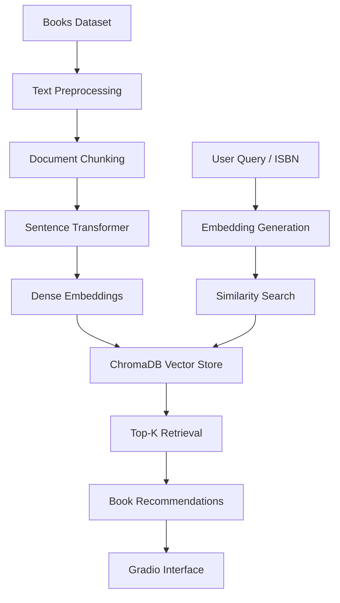

# 📚 Semantic Book Recommendation System

[](https://www.python.org/)
[](https://github.com/langchain-ai/langchain)
[](https://github.com/chroma-core/chroma)
[](https://gradio.app/)
[](https://huggingface.co/spaces)
[](https://huggingface.co/spaces/spicynick01/semantic_book_recommender)

An AI-powered recommendation engine that combines semantic search, transformer embeddings, and vector retrieval to deliver context-aware book recommendations based on user intent rather than simple keyword matching.

---

## 🌐 Live Demo

🚀 **Try the application here:**

**https://huggingface.co/spaces/spicynick01/semantic_book_recommender**

The application is deployed on Hugging Face Spaces and can be accessed directly through a web browser without any local setup.

---

## 🚀 Overview

Traditional recommendation systems often rely on keyword matching, popularity scores, or collaborative filtering, which can fail to understand the true intent behind a user's query.

This project leverages transformer-based embeddings and vector similarity search to recommend books based on semantic meaning, themes, emotions, and contextual relationships.

Example queries:

* "Fantasy books with magical schools"
* "Historical fiction set in ancient Egypt"
* "Psychological thrillers with unexpected endings"

Instead of matching keywords, the system retrieves books that are semantically similar to the user's intent.

---

## ✨ Key Features

* 🔍 Semantic Search using transformer embeddings
* 📚 ISBN-based and Natural Language Query Support
* ⚡ Fast Vector Similarity Retrieval with ChromaDB
* 🧠 Context-Aware Book Recommendations
* 🎨 Interactive Gradio User Interface
* 💾 Persistent Vector Database Storage
* ☁️ Hugging Face Spaces Deployment Ready
* 📈 Scalable Retrieval Pipeline

---

## 🏗️ System Architecture



---

## 🛠️ Technology Stack

### Programming Language

* Python

### NLP & Embeddings

* Sentence Transformers
* Hugging Face Transformers
* LangChain

### Vector Database

* ChromaDB

### Data Processing

* Pandas
* NumPy
* Scikit-Learn

### Frontend

* Gradio

### Deployment

* Hugging Face Spaces

### Version Control

* Git
* GitHub

---

## 📂 Project Structure

```bash
semantic_book_recommendation_system/
│
├── data/
│   └── books_with_emotions.csv
│
├── chroma_db/
│
├── notebooks/
│
├── src/
│
├── app.py
├── requirements.txt
├── README.md
└── assets/
```

---

## 🔬 Methodology

### 1. Data Preprocessing

* Text cleaning and normalization
* Metadata extraction
* Feature preparation

### 2. Embedding Generation

* Transformer-based sentence embeddings
* Dense vector representation of book descriptions

### 3. Vector Storage

* ChromaDB persistent vector database
* Efficient indexing and retrieval

### 4. Semantic Retrieval

* Query embedding generation
* Similarity matching
* Top-K recommendation ranking

---

## 📊 Example Queries

### Natural Language Search

```text
Fantasy books with magical schools
```

```text
Historical fiction set in ancient Egypt
```

```text
Psychological thrillers with unexpected endings
```

### ISBN Search

```text
9780439708180
```

---

## 📈 Results

* Improved recommendation relevance through semantic retrieval
* Faster search performance using vector indexing
* Better contextual understanding than traditional keyword search
* Scalable and deployment-ready architecture

---

## 🔮 Future Enhancements

* Retrieval-Augmented Generation (RAG)
* LLM-powered recommendation explanations
* Personalized recommendation engine
* User preference learning
* Multi-language support
* Cloud-scale vector search

---

## ⚙️ Installation

```bash
git clone https://github.com/spicynick111/semantic_book_recommendation_system.git

cd semantic_book_recommendation_system

pip install -r requirements.txt

python app.py
```

---

## 🚀 Usage

1. Launch the application.
2. Enter a book ISBN or natural language query.
3. Generate semantic recommendations.
4. Explore similar books through the interactive interface.

---

## 📄 License

This project is released under the MIT License.

---

## ⭐ Support

If you found this project useful, consider giving it a star on GitHub.
